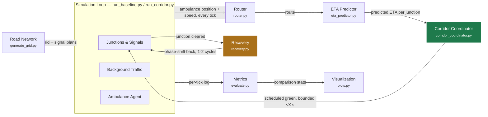
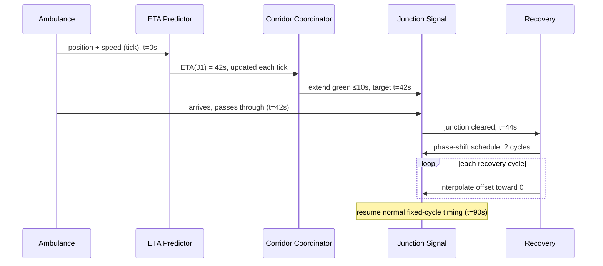
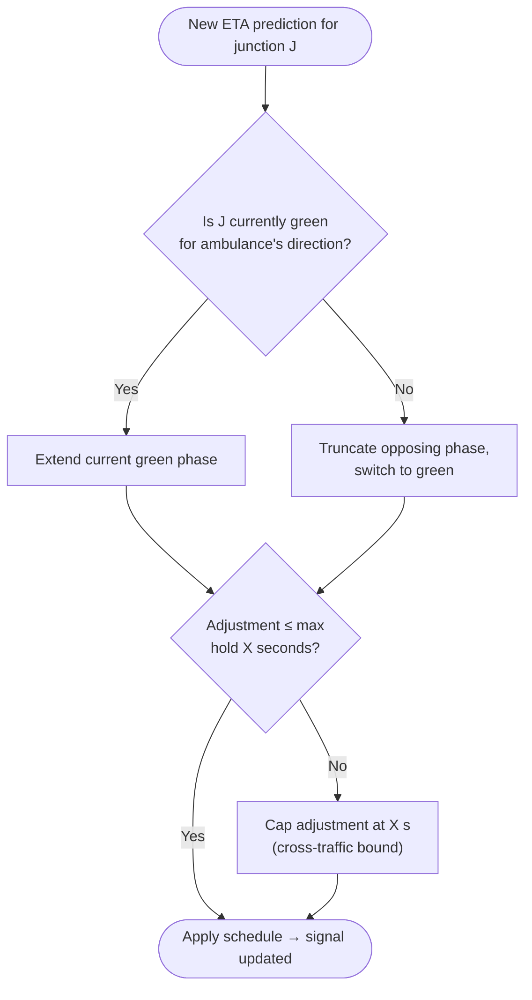
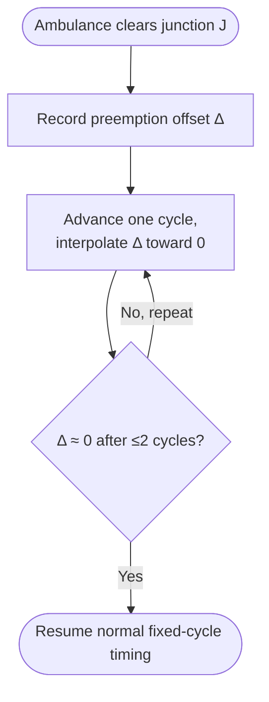

# Chapter 3 – Design Sheets (Pre-Implementation)

Four working drawings for the pre-implementation review: how the modules
connect, how a single preemption plays out over time, how the two novel
decision rules actually branch, and what the comparison output will look like
once [BUILD-PLAN.md](../BUILD-PLAN.md) Step 7 is real. All diagrams below are
Mermaid — they render directly on GitHub and in most Markdown viewers/IDEs.

Companion docs: [CLAUDE.md](../../CLAUDE.md) · [BUILD-PLAN.md](../BUILD-PLAN.md)
· [DECISIONS.md](../DECISIONS.md) · [MENTOR-PREP.md](../MENTOR-PREP.md)

---

## D1 — System Architecture

Which module owns which decision, and what crosses the boundary between them.
The two feedback arrows (green corridor scheduling, amber recovery) are the
whole point of the project — everything else is plumbing that makes those two
arrows possible.

**Reading it:**
- **Two write paths into the signal, not one.** Every reactive EVP system
  today has a single write path (detect → force green). This architecture has
  two, and recovery is a first-class producer of signal state, not a timeout.
- **Router and ETA Predictor are read-only** with respect to signals — they
  only ever consume position and produce a prediction. If either is wrong, it
  degrades the corridor's timing, but can't itself cause a bad signal write.
- **Metrics/Viz sit outside the control loop entirely** — they observe the
  tick log, never influence it, which is what keeps the three comparison runs
  (baseline / naive-reactive / corridor+recovery) honest.

---

## D2 — Sequence: One Preemption, Timed

The same architecture, walked forward through a single junction crossing with
a clock attached. This is the diagram that has to be right before
`core/corridor_coordinator.py` gets written, because it's the actual contract
between the five modules. Timings are illustrative.

**Reading it:**
- **The ETA→Coordinator message repeats every tick** in the real system (only
  one instance is drawn) — the "42s" prediction sharpens on each pass until
  the ambulance actually arrives, per Step 3 of the build plan.
- **t=42s is the hinge.** Everything before it is prediction and scheduling;
  everything after it is recovery — the two halves of the project's
  contribution, in one trace.
- **The recovery loop is the ~21% delay-reduction lever** the research
  motivation cites (see [CLAUDE.md](../../CLAUDE.md) §9). Collapsing it to an
  instant reset at t=44s instead of interpolating is exactly the
  naive-reactive baseline this diagram is *not* showing.

---

## D3 — Decision Logic: The Two Novel Rules

Both flowcharts are deliberately plain threshold rules, not optimizers (see
the "why heuristic, not ML" discussion — no learned model, no training data,
fully explainable). Left: the corridor scheduler deciding *whether to
preempt*. Right: recovery deciding *how fast to let go*.

### Corridor scheduling (`core/corridor_coordinator.py`)

### Recovery (`core/recovery.py`)

**Reading it:**
- **No branch ever schedules an unbounded hold.** Both flowcharts route every
  path through a cap check before touching the signal — this is the guardrail
  against starving cross-traffic, made explicit rather than implied.
- **Recovery has no early-exit path** back to instant reset — by
  construction, the graceful phase-shift is not optional or skippable once
  triggered, which is the structural difference from the naive-reactive
  baseline in Step 6.
- **X (max hold) and the 1–2 cycle recovery window** are exactly the two
  parameters flagged for the mentor in [MENTOR-PREP.md](../MENTOR-PREP.md)
  §10 — starting values, not tuned ones.

---

## D4 — Output Mockup (Illustrative, Not Real)

What Step 7 (`viz/plots.py`) needs to produce, sketched with placeholder
numbers so the shape of the comparison can be reviewed before any simulation
has actually run. **Every number below is a placeholder.**

### Signal-state timeline (per junction)

Illustrative state of each junction as the ambulance (**●**) moves through
the corridor. `GREEN*` = corridor-extended phase timed to the ambulance;
`RED~` = post-recovery normal cycle (still easing back).

| Time →     | 0–20s | 20–30s | 30–45s   | 45–70s   | 70–90s | 90s+   |
|------------|-------|--------|----------|----------|--------|--------|
| **J1**     | RED   | GREEN* | **●** GREEN* | RED~ | RED    | normal |
| **J2**     | RED   | RED    | GREEN*   | **●** GREEN* | RED~ | normal |
| **J3**     | RED   | RED    | RED      | GREEN*   | **●** GREEN* | RED~ → normal |

### Comparison metrics (target shape of Step 8's real output)

| Mode                     | Ambulance transit time | Avg. background delay |
|--------------------------|:----------------------:|:----------------------:|
| No preemption (baseline) | 210 s                  | 8 s                     |
| Naive reactive           | 165 s                  | 14 s                    |
| **Corridor + recovery**  | **150 s**               | **9 s**                 |

**Reading it:**
- These tables exist to validate the comparison *shape* — a signal timeline
  with an overlaid vehicle track, and two metrics across three modes — before
  `metrics/evaluate.py` produces real numbers.
- **Target result**: corridor+recovery sits lowest on transit time, and close
  to — ideally below — the no-preemption baseline on background delay,
  clearly beating naive-reactive on both.
- If Step 8's real numbers don't resemble this shape, that's a useful signal
  on its own: either the success criteria in
  [MENTOR-PREP.md](../MENTOR-PREP.md) §6 need revisiting, or the
  corridor/recovery parameters (X seconds, cycle count) need tuning.

---

**Next step:** [BUILD-PLAN.md](../BUILD-PLAN.md) Step 1 — `network/generate_grid.py`.
